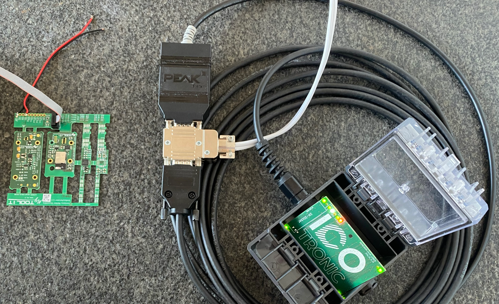
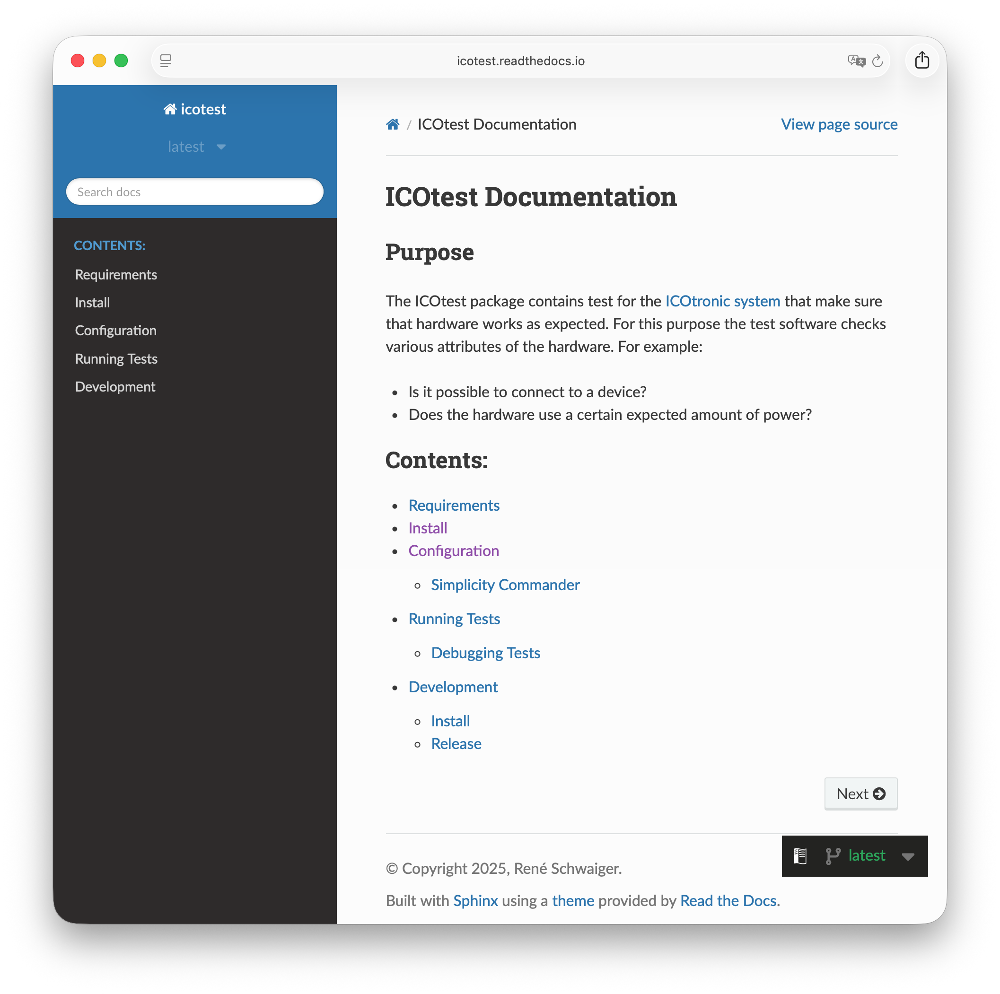
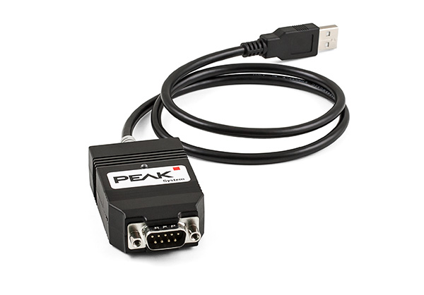
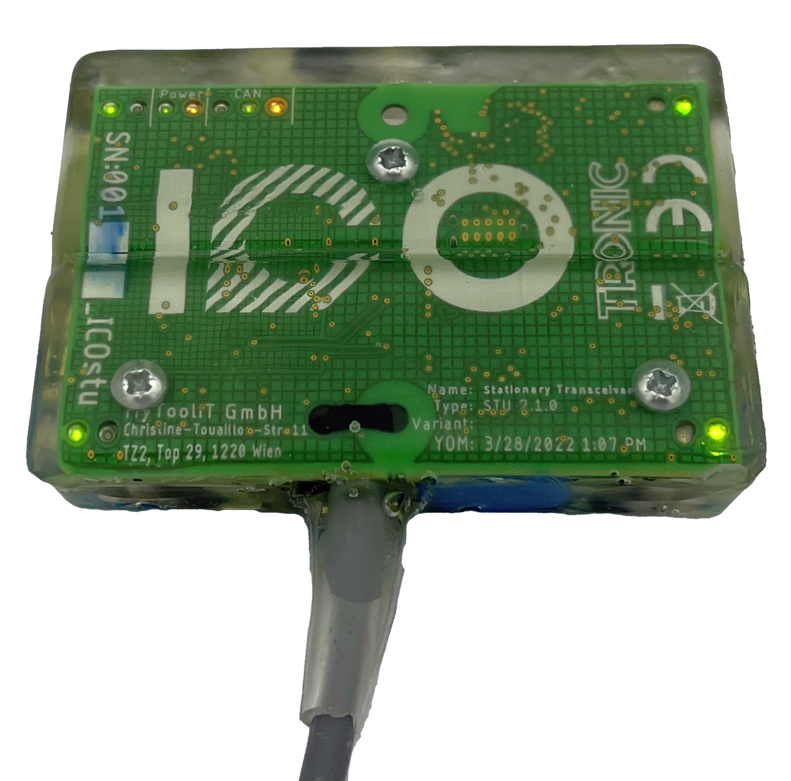
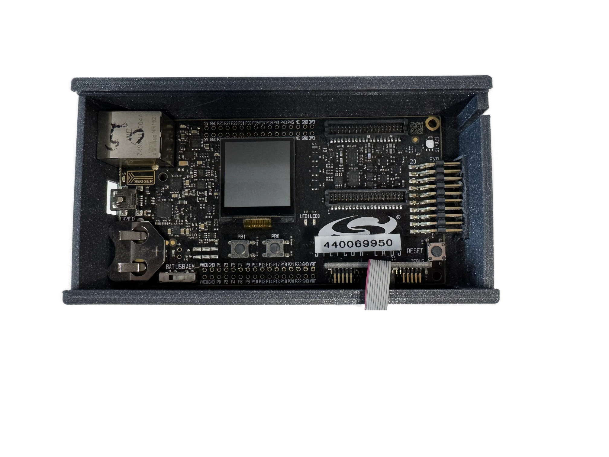
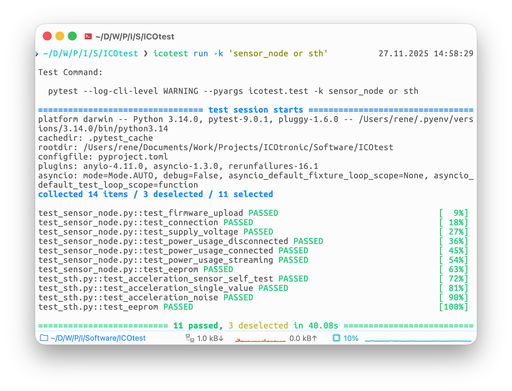

<!--
theme: default
paginate: true
_paginate: false
-->

<style>
section::after {
  content: attr(data-marpit-pagination) '/' attr(data-marpit-pagination-total);
}
</style>

# ICOtest • Production Tests for the ICOtronic System



<!--

- Kurze Einführung zum Thema Testen des ICOtronic Systems
- Testen in Verbindung mit Firmware (kein reiner Test der Hardware)

-->

---

# 📚 ICOtest

- Collection of [pytest](https://pytest.org) tests for [ICOtronic system](https://www.mytoolit.com/ICOtronic/):
  - STU (Stationary Transceiver Unit)
  - Sensor Nodes:
    - SHA (Sensory Holder Assembly)
    - STH (Sensory Tool Holder)
    - SMH (Sensory Milling Head)
- Python package available at [PyPI](https://pypi.org/project/icotest/):

  ```sh
  pip install icotest
  ```

- Documentation available at [Read The Docs](https://icotest.readthedocs.io)



<!--

- ICOtest: Python-Paket zum Testen mittels pytest
- Für die auf der Folie zu sehende ICOtronic hardware
- Dokumentation auf Read the Docs

-->

---

# 📋 Requirements

## Hardware

- CAN adapter
- ICOtronic hardware
- USB programmer <br/> (for firmware upload)





## Software

- Driver for CAN adapter
- Python
- ICOtest

<!--

Benötigte Hard- und Software

-->

---

# ⚙️ Usage

- ICOtest CLI tool to run tests:

  ```sh
  icotest run -k 'sensor_node or sth'
  ```

  Run test that contain pattern `sensor_node` or <br/> pattern `sth`

- Config of test parameters via YAML (`icotest config`):

  ```yaml
  # Product name for the  manufacturer (maximum of 128 byte UTF-8 encoded text)
  product name: "0"
  # The production date of the STH PCB in the format YYYY-MM-DD
  production date: 2025-01-01
  # Serial number for the manufacturer (maximum of 32 byte UTF-8 encoded text)
  serial number: "0"
  ```



<!--

# Verwendung

- `icotest run` (Wrapper für pytest)
- option `-k` um bestimmte Tests auszuwählen
- Konfiguration mittels YAML-File

-->

---

# 🚧 Current State

- Tests still need refinement
- Works on my machine 😅
- We probably need to add some **additional tests**
- **Default parameters** should be **updated** <br/> (by hardware expert)
- **Proper description** of test **procedure**
  - Which test commands do we need for which hardware
  - How do we document test results?
    - Output of test commands
    - Version of ICOtest


<!--

# Aktueller Stand

- Grundgerüst steht: Für Hardware auf meinem Tisch funktioniert es
- Zusätzliche Tests und Parameteranpassung fehlt noch:
  - Braucht Hardware-Experte
- Test-Prozedur sollte noch beschrieben werden

-->
